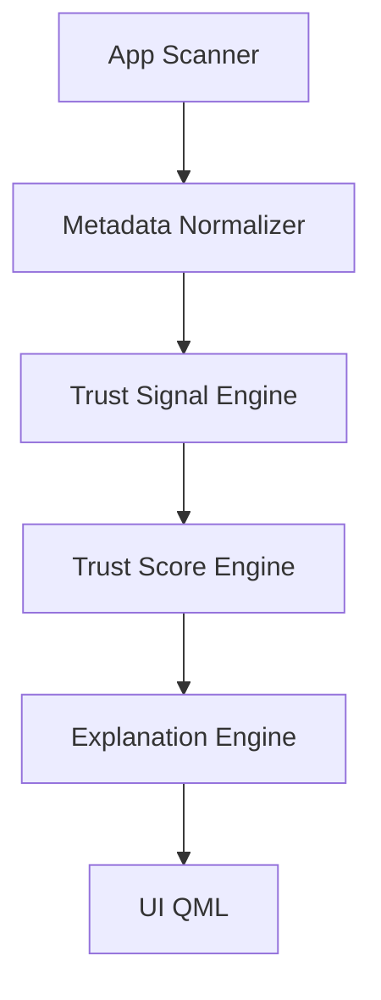

# Parallax Architecture & Trust Contract (Frozen v1)

## 1. Architectural Philosophy

Parallax is a **pure observer** and **deterministic explainer** of application trust.

| Rule              | Implication                                           |
| :---------------- | :---------------------------------------------------- |
| **Read-only**     | No mutation APIs. We do not change system state.      |
| **Offline**       | No HTTP, no telemetry. Privacy by design.             |
| **Deterministic** | Same input $\to$ Same output.                         |
| **Explainable**   | Every score must have a human-readable justification. |
| **Stateless**     | No background persistence. We re-evaluate on demand.  |

## 2. High-Level Architecture



**CRITICAL RULE**: The UI must **never** calculate trust. It only renders results from the engines.

## 3. AppTrustModel (Canonical v1)

The single source of truth object passed between modules.

```json
{
  "appId": "string",
  "displayName": "string",
  "version": "string",
  "iconPath": "string | null",
  "confinement": "strict | medium | weak",
  "permissions": {
    "network": "boolean",
    "camera": "boolean",
    "microphone": "boolean",
    "location": "boolean",
    "storage": "boolean"
  },
  "updateInfo": {
    "lastUpdated": "Date | null",
    "updateAgeMonths": "number | null",
    "isStale": "boolean"
  },
  "maintainer": {
    "name": "string | null",
    "present": "boolean"
  },
  "trust": {
    "score": "number (0-100)",
    "riskLevel": "low | medium | high"
  },
  "explanations": "string[]"
}
```

## 4. Trust Signal Taxonomy

Signals are facts derived from metadata.

- `USES_NETWORK`
- `USES_CAMERA`
- `USES_MICROPHONE`
- `USES_LOCATION`
- `USES_STORAGE`
- `STALE_APP`
- `MISSING_MAINTAINER`
- `WEAK_CONFINEMENT`
- `MEDIUM_CONFINEMENT`

## 5. Scoring Contract

**Starting Score**: 100
**Clamp**: 0 - 100

**Penalties**:

- Network: -15
- Camera: -20
- Microphone: -20
- Location: -15
- Storage: -10
- No updates >= 12mo (`STALE_APP`): -10
- Weak confinement: -15
- Medium confinement: -5
- Missing maintainer: -5

**Risk Levels**:

- **Low**: 80 - 100
- **Medium**: 50 - 79
- **High**: < 50

## 6. Explanation Contract

Every penalty triggers one explanation sentence.

- `USES_NETWORK`: "This app can access the internet."
- `STALE_APP`: "This app hasn’t been updated in over a year."
- `WEAK_CONFINEMENT`: "This app has fewer system restrictions than most apps."
  _(See code for full map)_
